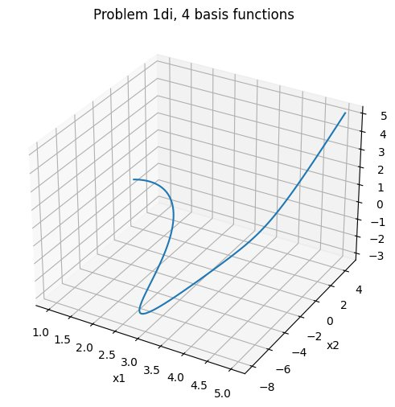
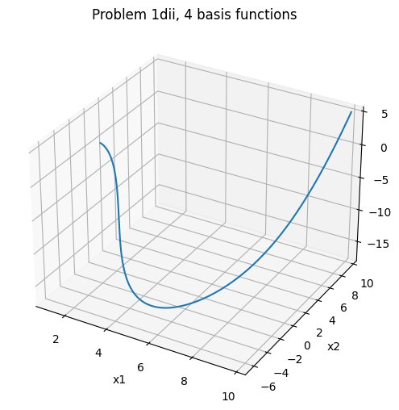

# Motion Control — Differential Flatness & Open-Loop Trajectory Tracking

This section moves beyond raw kinematics into **planning** and **control**: given a robot's equations of motion and a pair of boundary conditions in time, generate a feasible trajectory and then compute the control inputs that drive the robot along it. The technique here is **differential flatness** — a structural property that lets us design trajectories directly in the output space and recover state and controls by differentiation.

The notebook walks through three problems:

1. **Differential flatness of a nonholonomic integrator** — show the system is flat with output `z = (x1, x3)`, then construct the linear system `A·α = b` that solves for the trajectory coefficients under given boundary conditions.
2. **Differentially-flat trajectory generation for the extended unicycle**, followed by open-loop tracking via Euler integration.
3. **Open-loop tracking under noise** — inject Gaussian disturbances into the velocity and heading updates and observe trajectory drift.

## Files

```text
motion_control/
├── README.md
├── differential_flatness_and_open_loop_control.ipynb
└── figures/
    ├── q1di_4_basis_3d.png      ← high-resolution 3D trajectory for Q1d)i
    └── q1dii_4_basis_3d.png     ← high-resolution 3D trajectory for Q1d)ii
```

The notebook's inline plot outputs are committed and render directly on GitHub. The two PNGs in `figures/` are higher-resolution standalone exports of the Q1d) 3D trajectories, used inline below for readability.

## Background — What "differentially flat" means

A nonlinear system `ẋ = f(x, u)` is **differentially flat** if there exists a flat output `z = α(x, u)` such that both the state `x` and the controls `u` can be written as functions of `z` and a finite number of its time derivatives:

```text
x = β₁(z, ż, z̈, ...)
u = β₂(z, ż, z̈, ...)
```

If a system has this property, trajectory design collapses to a much simpler problem: pick a smooth path in `z`-space, differentiate to recover `x` and `u`, done. No need to integrate the nonlinear dynamics forward — the trajectory is feasible by construction.

The standard way to design such a trajectory is to expand each component of `z` in a basis of smooth functions of time:

```text
zⱼ(t) = Σᵢ αᵢ⁽ʲ⁾ · ψᵢ(t)
```

For polynomial bases `ψ₁ = 1, ψ₂ = t, ψ₃ = t², ψ₄ = t³`, the unknown coefficients `αᵢ⁽ʲ⁾` are fixed by the boundary conditions on `z` and `ż` at `t = 0` and `t = T`, producing a linear system `A · α = b` solved by pseudo-inverse (`np.linalg.pinv`).

---

## Q1 — The Nonholonomic Integrator

The nonholonomic integrator is a textbook example of a driftless control-affine system:

```text
ẋ₁ = u₁
ẋ₂ = u₂
ẋ₃ = x₂ · u₁
```

State `(x₁, x₂, x₃)`, controls `(u₁, u₂)`. The third equation couples state and input, which is what makes it nonlinear despite the simple form.

### Q1a — Showing the system is differentially flat

Take `z = (x₁, x₃)`. Then:

```text
x₁ = z₁                              (direct)
x₃ = z₂                              (direct)
x₂ = ż₂ / ż₁                         (from ẋ₃ = x₂·ẋ₁ = x₂·ż₁ = ż₂)
u₁ = ż₁                              (from ẋ₁ = u₁)
u₂ = ẍ₂ = d/dt (ż₂/ż₁)               (chain rule)
       = z̈₂/ż₁ − ż₂·z̈₁/ż₁²
```

All of `x` and `u` are expressed as functions of `z` and its derivatives, so the system is differentially flat with flat output `z = (x₁, x₃)`.

### Q1b — Trajectory design with four basis functions

Expanding `z₁(t)` and `z₂(t)` in four polynomial basis functions (constant, linear, quadratic, cubic) gives 8 unknown coefficients. Eight boundary conditions — `z₁(0), ż₁(0), z₂(0), ż₂(0), z₁(T), ż₁(T), z₂(T), ż₂(T)` — fix them via:

```text
| 1   0    0      0      0   0    0      0   |   | α₁₁ |   | z₁(0)  |
| 0   1    0      0      0   0    0      0   |   | α₁₂ |   | ż₁(0)  |
| 0   0    0      0      1   0    0      0   |   | α₁₃ |   | z₂(0)  |
| 0   0    0      0      0   1    0      0   | · | α₁₄ | = | ż₂(0)  |
| 1   T    T²     T³     0   0    0      0   |   | α₂₁ |   | z₁(T)  |
| 0   1    2T     3T²    0   0    0      0   |   | α₂₂ |   | ż₁(T)  |
| 0   0    0      0      1   T    T²     T³  |   | α₂₃ |   | z₂(T)  |
| 0   0    0      0      0   1    2T     3T² |   | α₂₄ |   | ż₂(T)  |
```

Note the boundary condition `ż₂(0) = ẋ₃(0) = x₂(0)·ẋ₁(0)` couples two of the original state variables. The same coupling applies at `t = T`.

### Q1c — Trajectory design with six basis functions

Adding `ψ₅ = t⁴, ψ₆ = t⁵` gives 12 unknowns against the same 8 boundary conditions. The system becomes `8 × 12` — under-determined — and is solved by the **Moore–Penrose pseudo-inverse**, which selects the minimum-norm `α` consistent with the constraints. More basis functions don't necessarily mean better trajectories: past a point, computational cost rises without meaningful improvement in fit, since the extra degrees of freedom only smooth the unconstrained interior.

### Q1d)i — Numerical results, initial conditions set 1

Initial conditions: `x₁(0)=1, x₂(0)=0, x₃(0)=-3, ẋ₁(0)=1`
Final at `T=10`: `x₁(10)=5, x₃(10)=5, ẋ₁(10)=1`

The recovered `x₂(0) = ż₂(0)/ż₁(0) = x₂(0)·ẋ₁(0)/ẋ₁(0) = 0` is consistent with the given boundary, and `ẋ₃(0) = x₂(0)·ẋ₁(0) = 0` is enforced in the `b` vector. The 3D trajectory in `(x₁, x₂, x₃)`-space:



The corresponding control inputs `u₁ = ż₁` (linear in `t`) and `u₂ = z̈₂/ż₁ − ż₂·z̈₁/ż₁²` (rational in `t`) are plotted inline in the notebook.

### Q1d)ii — Numerical results, initial conditions set 2

Initial conditions: `x₁(0)=1, x₂(0)=2, x₃(0)=1, ẋ₁(0)=1`
Final at `T=15`: `x₁(15)=10, x₃(15)=5, ẋ₁(15)=1`



Note `ẋ₃(0) = x₂(0)·ẋ₁(0) = 2` and `ẋ₃(T) = x₂(T)·ẋ₁(T) = 10·1 = 10`, which enter the `b` vector at positions 4 and 8 respectively. The trajectory shape is qualitatively richer here because the larger time horizon gives the cubic polynomials more room to vary.

---

## Q2 — The Dynamically-Extended Unicycle

This is the unicycle model with velocity promoted to a state:

```text
ẋ = V · cos(θ)
ẏ = V · sin(θ)
V̇ = a              (a = linear acceleration, control)
θ̇ = ω              (ω = angular velocity, control)
```

State `(x, y, V, θ)`, controls `(a, ω)`.

### Q2a — Showing the system is differentially flat with `z = (x, y)`

Direct identification: `x = z₁`, `y = z₂`. The velocity magnitude follows from the Pythagorean form of the velocity components:

```text
V = √(ẋ² + ẏ²) = √(ż₁² + ż₂²)
```

Differentiating once more gives the linear acceleration in terms of second derivatives of `z`:

```text
V̇ = a = (ż₁·z̈₁ + ż₂·z̈₂) / √(ż₁² + ż₂²)
```

The heading angle and its rate are:

```text
θ = atan2(ż₂, ż₁)
θ̇ = ω = (ż₁·z̈₂ − ż₂·z̈₁) / (ż₁² + ż₂²)
```

Every state and control is a function of `z` and its first two derivatives — the system is differentially flat.

### Q2b — Trajectory generation

Using the same four-basis matrix form from Q1b, with boundary conditions:

```text
x(0)=0, y(0)=0, V(0)=0.5, θ(0)=-π/2
x(T)=5, y(T)=5, V(T)=0.5, θ(T)=-π/2     where T=15
```

The boundary values for `ż₁(0), ż₂(0), ż₁(T), ż₂(T)` are obtained from the velocity decomposition `ż₁ = V·cos(θ)`, `ż₂ = V·sin(θ)`. Solving for `α` produces a polynomial trajectory in the `(x, y)` plane; this is plotted inline in the notebook.

### Q2c — Open-loop tracking via Euler integration

Once `z₁(t), z₂(t)` and their first and second derivatives are known analytically (the planned trajectory), the controls at each instant are recovered by inverting:

```text
| ẍ |   | cos(θ)   -V·sin(θ) | | a |
|   | = |                    | |   |
| ÿ |   | sin(θ)    V·cos(θ) | | ω |
```

This `2×2` matrix is invertible whenever `V ≠ 0`. The notebook applies `np.linalg.pinv` at each timestep and then advances the true (simulated) robot state with Euler integration:

```text
x[i+1]   = x[i]   + Δt · V[i] · cos(θ[i])
y[i+1]   = y[i]   + Δt · V[i] · sin(θ[i])
V[i+1]   = V[i]   + Δt · a[i]
θ[i+1]   = θ[i]   + Δt · ω[i]
```

With `Δt = 0.01` and no noise, the simulated position tracks the planned trajectory closely.

The notebook also includes an **alternative feed-forward formulation** that pre-computes `a_d(t), ω_d(t)` analytically from the trajectory derivatives, avoiding the per-step matrix inverse:

```text
V_d = √(ż₁² + ż₂²)
a_d = (ż₁·z̈₁ + ż₂·z̈₂) / V_d
ω_d = (ż₁·z̈₂ − ż₂·z̈₁) / V_d²
```

This bypasses numerical issues when `V → 0` (the matrix-inversion form becomes singular) by adding a small floor to `V_d` before division.

---

## Q3 — Open-Loop Tracking Under Noise

The same simulation as Q2c, but with Gaussian disturbances injected into the velocity and heading updates:

```text
V[i+1]   = V[i]   + Δt · a[i] + N(0, 0.01)
θ[i+1]   = θ[i]   + Δt · ω[i] + N(0, 0.001)
```

The result is a drifting trajectory — the open-loop controller has no feedback, so any error injected at step `i` propagates forward indefinitely. The plot in the notebook shows the simulated position diverging visibly from the planned trajectory, which is the qualitative point of the exercise: open-loop control is fragile, and any practical system needs closed-loop correction. (That closed-loop correction is the subject of the next section, [`algorithms/`](../algorithms/).)

---

## How to Run

```bash
cd motion_control
pip install -r ../requirements.txt
jupyter notebook differential_flatness_and_open_loop_control.ipynb
```

Run the cells top-to-bottom. The committed notebook already has plot outputs embedded, so the section renders fully on GitHub without execution.

## Known Limitations

- **Q1d)i — Dead variable.** The boundary-condition initialization for the first numerical-results cell sets `x2f = 6`, but the intended value (per the problem's spec) is `x₂(10) = 5`. Since the flat output is `z = (x₁, x₃)`, this variable is never actually placed into the `b` vector (only `x3f` is), so it has no effect on the computed trajectory. It's a leftover typo from initial setup that should be cleaned up to `x2f = 5` for clarity. The trajectory plotted is correct.
- **Q2c — `plt.show()` inside the integration loop.** The Q2c Euler-tracking cell calls `plt.show()` inside its integration loop. Running this cell from scratch produces 1500 intermediate plots (one per timestep), one of which is the meaningful final overlay. The outputs of that cell are stripped from the committed notebook to keep file size reasonable; a clean post-loop cell renders the final overlay. The fix is to move `plt.show()` out of the loop.
- **Q2c and Q3 — Only `Δt = 0.01` is committed.** The original exploration covered both `Δt = 0.1` and `Δt = 0.01`. The notebook only retains the `Δt = 0.01` runs. To reproduce the larger-timestep case, change `dt = 0.01` to `dt = 0.1` in the relevant cells and re-run. Expected behavior: with `Δt = 0.1`, discretization error is visible even in the noise-free case as a small offset between the planned and simulated paths.
- **Q3 — Unseeded RNG.** `np.random.normal` is called without setting a seed, so each run produces a different noise realization. Result plots are not reproducible run-to-run. To reproduce, add `np.random.seed(<int>)` before the Q3 loop.

## License

MIT — see [LICENSE](../LICENSE) in the repository root.
